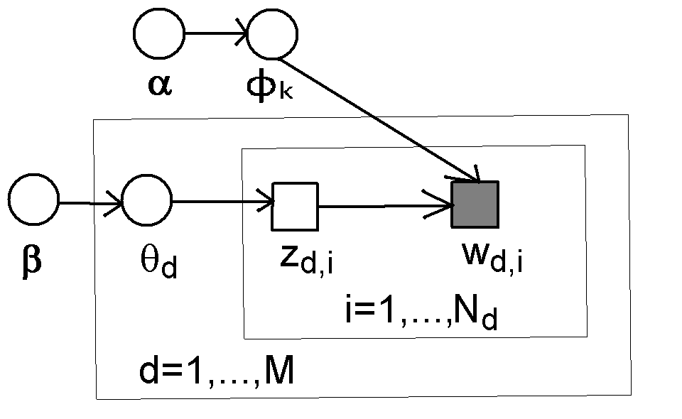

```{r setup, include=FALSE}
knitr::opts_chunk$set(echo = FALSE)
options(tinytex.verbose = TRUE)

library(ggplot2) # main library for data visualization
```

# Introduction

## R Markdown

This is an R Markdown presentation. Markdown is a simple formatting syntax for authoring HTML, PDF, and MS Word documents. For more details on using R Markdown see <http://rmarkdown.rstudio.com>.

\bigskip

When you click the **Knit** button a document will be generated that includes both content as well as the output of any embedded R code chunks within the document.

## Description

This R Markdown and Beamer template is created by **Christine P. Chai** (cpchai21@gmail.com). She started with the existing template of the R Markdown presentation, and she incorporated some commonly-used LaTeX functions in this version.  

\bigskip

If the compilation in **Knit** does not succeed (resulting a corrupted PDF file), then we need to go into "MikTeX Console $\rightarrow$ Settings" and select "Always install missing packages on-the-fly". Then RStudio can automatically install the required LaTeX packages.


# Section 1


## Slide with Bullets

- Bullet 1

\bigskip

- Bullet 2

\bigskip

- Bullet 3

## Slide with a Quote

\Large
"All models are wrong, but some are useful."

\normalsize

\begin{flushright}
-- George Box, Statistician
\end{flushright}

## Content with Two Columns

\begincols
  \begincol{.50\textwidth}

First column 

\bigskip

Write something here  

Write more

\bigskip

Closing sentence

  \endcol
  \begincol{.50\textwidth}

Second column  

\bigskip

Use `itemize` in LaTeX.

\bigskip

\begin{itemize}
\item Item 1
\item Item 2
\item Item 3
\end{itemize}

  \endcol
\endcols

## Different Font Sizes

\begincols
  \begincol{.50\textwidth}

\begin{itemize}
\item {\tiny tiny}
  \medskip
\item {\scriptsize scriptsize}
  \medskip
\item {\footnotesize footnotesize}
  \medskip
\item {\small small}
  \medskip
\item {\normalsize normalsize (default)}
\end{itemize}

  \endcol
  \begincol{.50\textwidth}

\begin{itemize}
\item {\large large}
  \medskip
\item {\Large Large}
  \medskip
\item {\LARGE LARGE}
  \medskip
\item {\huge huge}
  \medskip
\item {\Huge Huge}
\end{itemize}

  \endcol
\endcols

\bigskip

\bigskip

\bigskip

\footnotesize <https://www.sascha-frank.com/latex-font-size.html>

# Section 2

## Slide with R Output

```{r cars, echo = TRUE}
summary(cars)
```

## Slide with Plot -- Original

```{r cars-ggplot}
ggplot(data = cars, aes(x = speed, y = dist)) + geom_point()
```


## Slide with Plot -- Larger Text

```{r cars-larger-text}
ggplot(data = cars, aes(x = speed, y = dist)) +
  geom_point(size=4) +
  theme_bw(base_size=24)
```

## Slide with Fractions of Code

`R` package: `ggplot2` 

\bigskip

`scale_color_manual(values=c("red","darkgreen","black"))`  

`scale_linetype_manual(values=c("dashed","solid","dotted"))`  

`scale_shape_manual(values=c("square","circle","triangle"))`  

## Slide with Image

```{r test-image, fig.align="center", out.width = "90%"}
# out.width and out.height are the parameters that control the PDF/HTML output.

``` 

\footnotesize C.P. Chai. Word Distinctivity -- Quantifying Improvement of Topic Modeling Results from N-Gramming. Accepted to REVSTAT Statistical Journal, 2020. 

# Closing

## Possible to Mix and Match

\begincols
  \begincol{.50\textwidth}

\begin{center}
\huge Have fun!
\end{center}

  \endcol
  \begincol{.50\textwidth}


  \endcol
\endcols